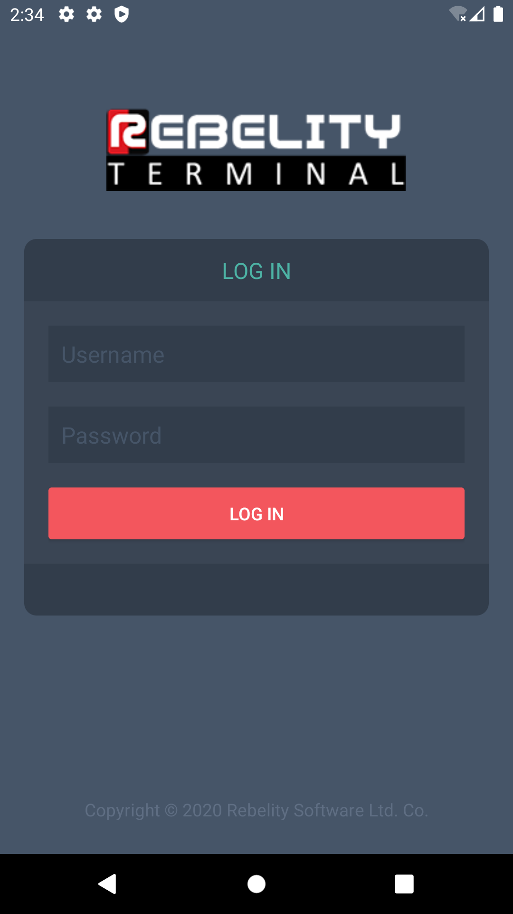
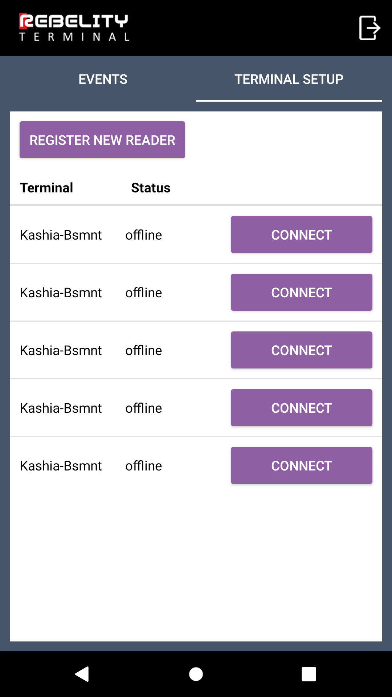
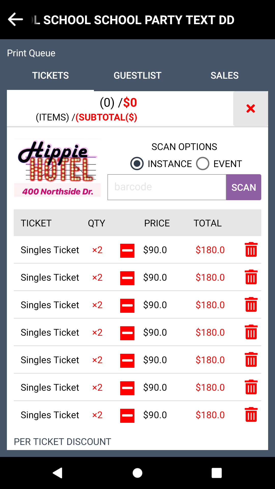
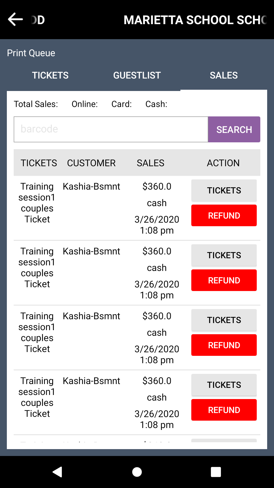

# RebelityTerminal_Android
This app is for POS(Point Of Sales System) with stripe payment based on stripe terminal.

---

## App Name
Rebelity

---

## App background

The app is for the POS system to sale tickets on the specific events based on Stripe Payment Terminal.
The app connects Stripe terminal and Bluetooth printers.
Saler input barcode from tickets to the app, then app shows information of the tickets, and he/her add the ticket to the POS system.
and, send receiption by email and text. then, prints receiption

---

## Skills

1. Android, Java, RxJava, Retrofit.
2. Stripe Payment Terminal, Bluetooth Printer, Barcode Recogination.
2. RESTful API
3. Https, Thread

---

## ScreenShots

    
    
    
    

